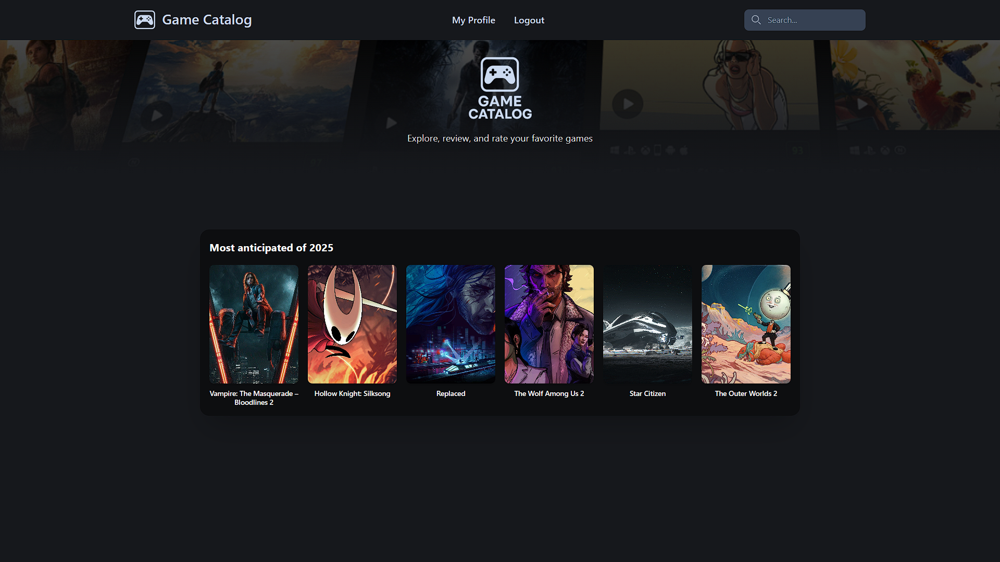
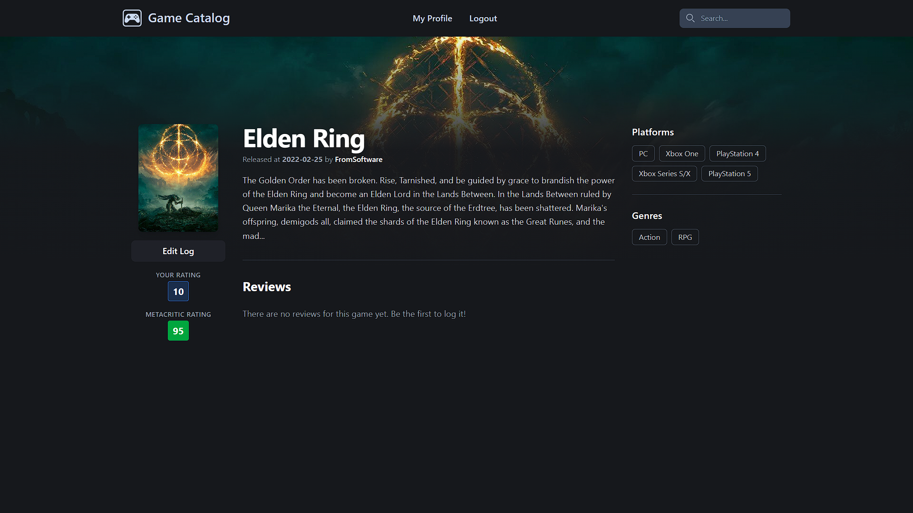
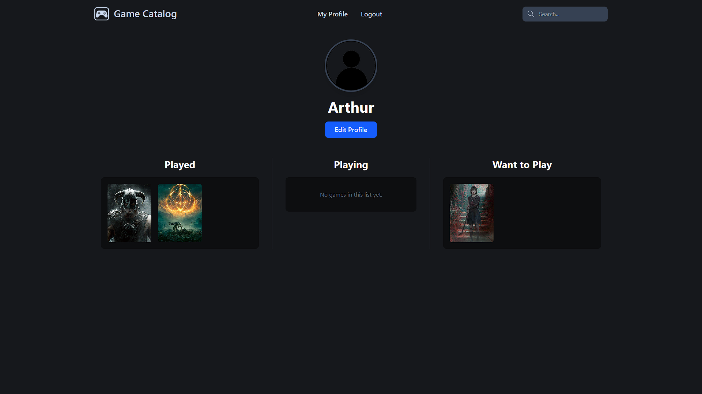

# Game Catalog

Game Catalog is a web application developed in Python and Flask that allows users to explore, search, and catalog their favorite games. The application uses the RAWG Video Games Database API to obtain detailed information about the games.

## Features

- **Detailed Game Pages:** Complete information on each game, including Metacritic ratings and reviews from other users.
- **User Profiles:** Each user has a personal profile where they can see their games cataloged as "Played," "Playing," and "Want to Play."
- **Advanced Search:** Search functionality to find games by title.
- **Browse by Category:** Explore games by platform, genre, and developer.
- **Game Logging:** Users can add games to their profile with a status, score, and a review.
- **User Authentication:** A complete system for account creation, login, and logout.

## Demo

Here are some screenshots of the application:

**Homepage:**



**Game Page:**



**User Profile:**



## Technologies Used

- **Backend:** Python, Flask
- **Frontend:** HTML, CSS, Tailwind
- **Database:** SQLite
- **API:** RAWG Video Games Database API

## Installation and Setup

Follow the steps below to set up and run the project locally:

1.  **Clone the repository:**

    ```bash
    git clone https://github.com/arthurdoli/game-catalog.git
    cd game-catalog
    ```

2.  **Create and activate a virtual environment:**

    ```bash
    python -m venv venv
    # No Windows
    venv\Scripts\activate
    # No macOS/Linux
    source venv/bin/activate
    ```

3.  **Install the dependencies:**

    ```bash
    pip install -r requirements.txt
    ```

4.  **Set up the environment variables:**
    Create a `.env` file in the project root and add the following variables:

    ```
    API_KEY=YOUR_RAWG_API_KEY
    SECRET_KEY=YOUR_FLASK_SECRET_KEY
    ```

    - You can get a free API key at [rawg.io/apidocs](https://rawg.io/apidocs).

5.  **Create the database:**

    ```bash
    python create_db.py
    ```

6.  **Run the application:**
    ```bash
    python main.py
    ```

## Project Structure

```bash
game-catalog/
├── gamecatalog/
│ ├── static/
│ │ ├── css/
│ │ └── images/
│ ├── templates/
│ ├── init.py
│ ├── forms.py
│ ├── models.py
│ └── routes.py
├── .gitignore
├── create_db.py
├── main.py
├── requirements.txt
└── README.md
```

- **gamecatalog/\_\_init\_\_.py:** Flask application initialization.
- **gamecatalog/routes.py:** Definition of the application's routes and logic.
- **gamecatalog/models.py:** Database models (users and game logs).
- **gamecatalog/forms.py:** Application forms (registration, login, etc.).
- **gamecatalog/templates/:** HTML files with the page structure.
- **gamecatalog/static/:** Static files (CSS, images).
- **main.py:** Entry point to run the application.
- **create_db.py:** Script to create the database.

## Author

- **Arthur Duarte** - [arthurdoli](https://github.com/arthurdoli)
