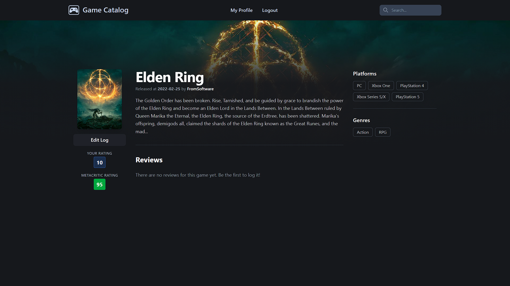
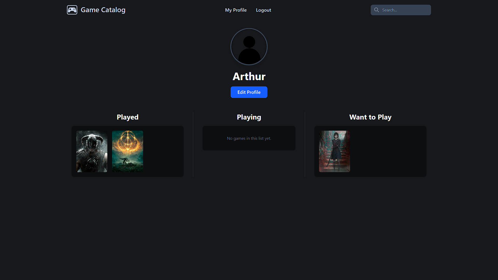

# Game Catalog

O Game Catalog é uma aplicação web desenvolvida em Python e Flask que permite aos utilizadores explorar, pesquisar e catalogar os seus jogos favoritos. A aplicação utiliza a API da RAWG Video Games Database para obter informações detalhadas sobre os jogos.

## Funcionalidades

- **Páginas de Jogos Detalhadas:** Informações completas sobre cada jogo, incluindo classificação do Metacritic e críticas de outros utilizadores.
- **Perfis de Utilizador:** Cada utilizador tem um perfil pessoal onde pode ver os seus jogos catalogados como "Jogados", "A Jogar" e "Quero Jogar".
- **Pesquisa Avançada:** Funcionalidade de pesquisa para encontrar jogos por título.
- **Navegação por Categorias:** Explore jogos por plataforma, género e criador.
- **Registo de Jogos:** Os utilizadores podem adicionar jogos ao seu perfil com um estado, pontuação e uma crítica.
- **Autenticação de Utilizador:** Sistema completo de criação de conta, login e logout.

## Demonstração

Aqui ficam algumas capturas de ecrã da aplicação:

**Página Inicial:**


**Página de Jogo:**



**Perfil de Utilizador:**



## Tecnologias Utilizadas

- **Backend:** Python, Flask
- **Frontend:** HTML, CSS, Tailwind
- **Base de Dados:** SQLite
- **API:** RAWG Video Games Database API

## Instalação e Configuração

Siga os passos abaixo para configurar e executar o projeto localmente:

1.  **Clone o repositório:**

    ```bash
    git clone https://github.com/arthurdoli/game-catalog.git
    cd game-catalog
    ```

2.  **Crie e ative um ambiente virtual:**

    ```bash
    python -m venv venv
    # No Windows
    venv\Scripts\activate
    # No macOS/Linux
    source venv/bin/activate
    ```

3.  **Instale as dependências:**

    ```bash
    pip install -r requirements.txt
    ```

4.  **Configure as variáveis de ambiente:**
    Crie um ficheiro `.env` na raiz do projeto e adicione as seguintes variáveis:

    ```
    API_KEY=SUA_CHAVE_API_DA_RAWG
    SECRET_KEY=SUA_CHAVE_SECRETA_PARA_O_FLASK
    ```

    - Pode obter uma chave de API gratuita em [rawg.io/apidocs](https://rawg.io/apidocs).

5.  **Crie a base de dados:**

    ```bash
    python create_db.py
    ```

6.  **Execute a aplicação:**
    ```bash
    python main.py
    ```

## Estrutura do Projeto

```bash
game-catalog/
├── gamecatalog/
│ ├── static/
│ │ ├── css/
│ │ └── images/
│ ├── templates/
│ ├── init.py
│ ├── forms.py
│ ├── models.py
│ └── routes.py
├── .gitignore
├── create_db.py
├── main.py
├── requirements.txt
└── README.md
```

- **gamecatalog/\_\_init\_\_.py:** Inicialização da aplicação Flask.
- **gamecatalog/routes.py:** Definição das rotas e lógica da aplicação.
- **gamecatalog/models.py:** Modelos da base de dados (utilizadores e registos de jogos).
- **gamecatalog/forms.py:** Formulários da aplicação (registo, login, etc.).
- **gamecatalog/templates/:** Ficheiros HTML com a estrutura das páginas.
- **gamecatalog/static/:** Ficheiros estáticos (CSS, imagens).
- **main.py:** Ponto de entrada para executar a aplicação.
- **create_db.py:** Script para criar a base de dados.

## Autor

- **Arthur Duarte** - [arthurdoli](https://github.com/arthurdoli)
